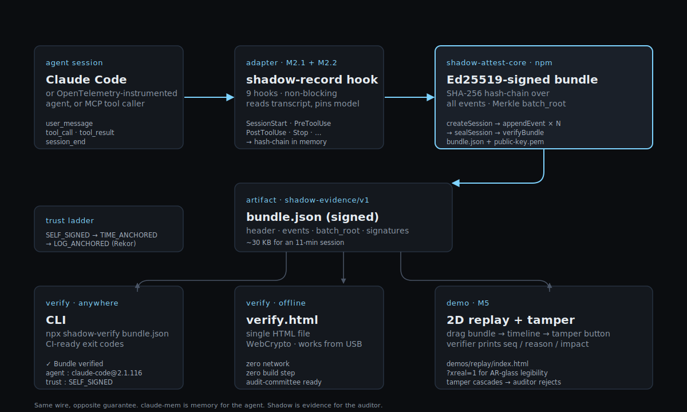

# Shadow

**A cryptographic evidence layer for AI agents.** Every session becomes a signed, hash-chained record you can hand an auditor. Verify offline with a single HTML file.

> *Same wire, opposite guarantee.* `claude-mem` is memory for the agent. Shadow is evidence for the auditor. Both hook the same Claude Code events. Different jobs.

<p align="center">
  
</p>

**Why now** — three external signals converged 2026-07:

- **Anthropic Claude Code v2.1.205 (2026-07)** added auto-mode rules preventing tampering with session transcript files — Anthropic itself now treats session integrity as a first-class concern. Shadow ships the receipt for the integrity Anthropic quietly acknowledged. [changelog](https://github.com/anthropics/claude-code/blob/main/CHANGELOG.md)
- **Terry Tao publicly used a coding agent to rebuild an app (2026-07-11)** — a Fields medalist blessing the category means the "are AI coding tools serious?" argument is over. What comes next is trust and auditability. [terrytao.wordpress.com](https://terrytao.wordpress.com/2026/07/11/old-and-new-apps-via-modern-coding-agents/)
- **arxiv 2606.04990 — "From Agent Traces to Trust" survey** frames *execution provenance + evidence tracing* as the emerging trust primitive for LLM agents. Shadow ships the working code for the category the literature just named. [arxiv](https://arxiv.org/html/2606.04990v1)

**First vertical**: AI-assisted credit decisions. Shadow signs each decision — verdict, adverse-action reason codes, model manifest, dictionary hash — with Ed25519, chains them with SHA-256, and lets a third party verify months later that the decision was not silently rewritten. The verdict engine itself is deterministic rules; the LLM personas produce prose rationale for human reviewers but cannot change the verdict.

**Second vertical (in progress, target 2026-08-02)**: session-level evidence bundles via `@shadow/adapter-claude-code` — every Claude Code session auto-produces a signed bundle. See [`packages/adapter-claude-code/`](./packages/adapter-claude-code/).

**Status**: pre-1.0. Not audited. Not a compliance product — it produces evidence that supports a compliance narrative.

**What Shadow proves, precisely.** Shadow attests **integrity**: the recorded events were not silently rewritten after the seal. It does **not** attest **content authenticity**: whether the agent's behavior at capture time was benign, prompt-injection-free, or policy-compliant. A green `✓ Bundle verified` means "this is the record that was signed" — not "this session was safe". The v3.1 roadmap adds optional injection-detection markers so an auditor can see which events were flagged as suspicious at capture (integrity + suspicion, honestly labeled — not integrity + a clean bill of health we can't give). See [`docs/THREAT_MODEL.md`](./docs/THREAT_MODEL.md) for the seven-class attack table.

**Zero telemetry.** Shadow does not phone home. No usage pings, no crash reports, no analytics — from either the library or the CLI verifiers. Verify by grepping the source: neither `shadow-attest-core` nor any CLI in `bin/` opens an outbound socket to a Shadow-controlled host. Security policy: [`SECURITY.md`](./SECURITY.md).

<!-- readme-stats:begin -->
**Version**: 2.0.3
**Tests**: 1582/1585 passing (0 failing)
**Attestation signed fields**: 21 parameters, 14 append-only conditional bindings
**Release tags**: 59
<!-- readme-stats:end -->

Numbers above are regenerated from source by `node scripts/readme-stats.mjs --write`. CI blocks pushes where they drift.

## 60-second verify demo

Clone the repo, run the acceptance demo, and see the tamper-detection path fire end-to-end:

```bash
git clone https://github.com/alex-jb/shadow-mentor
cd shadow-mentor && npm install
npm run demo:attestation
```

The demo generates an Ed25519 keypair, signs 3 loan decisions, verifies them, then mutates one byte and shows the verifier detect the tamper. No external LLM calls, no API keys required.

### Or install from npm

The core primitives ship as [`shadow-attest-core`](https://www.npmjs.com/package/shadow-attest-core) on npm:

```bash
npm install shadow-attest-core
```

Includes all of M1 (evidence bundle) + M3 (external anchoring: RFC 3161 TSA + Sigstore Rekor + CA trust store) + M4 (offline verify). Current published version **2.1.0** (2026-07-17, from operator laptop — provenance to be added on a later version via the CI workflow). The OpenTelemetry adapter ships alongside as [`shadow-adapter-otel`](https://www.npmjs.com/package/shadow-adapter-otel) (`npm install shadow-adapter-otel`): map any instrumented agent's OTel GenAI/MCP spans onto signed evidence.

## v3 evidence bundle — flight recorder for AI agents

Shadow v3 (in progress, target ship 2026-08-02) generalizes the per-decision attestation into a **session-level evidence bundle**: one signed, hash-chained record of what an AI agent did, independently verifiable offline. The credit-decision vertical becomes the first reference implementation; the same primitive covers Claude Code sessions, MCP tool calls, or any OpenTelemetry-instrumented agent.

Spec: [`spec/EVIDENCE_BUNDLE.md`](./spec/EVIDENCE_BUNDLE.md) · schema: [`spec/evidence-bundle.schema.json`](./spec/evidence-bundle.schema.json).

**Shipping today (M1 + M2.3 + M4):**

```js
import { createSession, appendEvent, sealSession, verifyBundle } from "shadow-attest-core";

const session = createSession({
  agent: { name: "claude-code", version: "1.2.3" },
  models: [{ model_id: "anthropic:claude-sonnet-4-6", provider: "anthropic" }],
  environmentFingerprint: { os: "darwin-25.3.0", node_version: process.version },
  keyId: "prod-2026-Q3",
  privateKey,
});

appendEvent(session, { event_type: "user_message", actor: "user", payload: { text: "..." } });
appendEvent(session, { event_type: "tool_call",    actor: "agent", payload: { tool: "grep" } });
appendEvent(session, { event_type: "tool_result",  actor: "tool",  payload: { hits: 0 } });

const bundle = sealSession(session);
// bundle is signed, chained, verifiable offline
```

Verify a bundle three different ways:

- **Browser** — drag any `bundle.json` into [`verify.html`](./verify.html). Zero network, zero build step, works from a USB stick. Includes a matching key-in / green-red UI for auditor workflows.
- **CLI** — `npm run verify:bundle -- <bundle.json> --public-key <public.pem>` (aka `node bin/shadow-verify.mjs`). CI-friendly exit codes: `0` verified, `1` failed, `2` usage, `3` I/O.
- **GitHub Action** — [`.github/actions/shadow-verify`](./.github/actions/shadow-verify) composite action. Wire it into a PR workflow and any bundle change that breaks the chain fails the merge.

**Verifiability as a badge.** Consumers can verify their own committed bundle in their own CI with the Action above and put a green *audit chain* badge on their README — they advertise their own credibility, and it turns red the moment a record is silently rewritten. Recipe (3-line workflow + badge, plus why a hosted URL-fetch badge is intentionally not shipped — SSRF): [`docs/wedge/verifiability-badge.md`](./docs/wedge/verifiability-badge.md).

**v3 M1.2 acceptance criteria (all met):**

- 10,000-event session seals + verifies in **69 ms** on an M-series MacBook (5 s target, 72× under)
- Kill -9 mid-session leaves a JSONL log that `recoverSession` + `sealPartialBundle` turn into a valid partial bundle
- Any byte-tamper / event reorder / event deletion fails verification with a precise `{failedSeq, reason}`

Payloads are content-addressed and stored separately from event records, so a GDPR erasure request nulls the `payload_ref` without invalidating the chain (`payload_hash` stays; the store empties).

## Architecture

Two layers. See [`docs/ARCHITECTURE.md`](./docs/ARCHITECTURE.md) for details.

**Verdict engine** — `lib/run-loan-council.js`, deterministic. Reads a loan schema (`credit_score`, `debt_to_income`, `loan_to_value`, amount, sector) and returns one of `refuse_to_serve` / `block` / `escalate` / `approve` via named-constant thresholds. No LLM call inside this path. Reproducible bit-for-bit given the same input. This is the layer the attestation binds.

**Rationale layer** — `lib/prompts.js` + `api/deliberate.js`. Five persona prompts run against an LLM to generate prose explanations of the verdict — one for Credit Fundamentals, Risk Officer, Fair Lending Compliance, Customer Advocate, Macro Contrarian. The rationale layer is advisory. It cannot change the verdict; the resolver has already run. Useful for the human reviewer building the adverse-action notice narrative and for the internal-audit workpaper.

**Attestation layer** — `lib/attestation.js`. Ed25519 signs a canonical serialization of the verdict, the model_id, the input commitment, the output commitment, the previous_hash (chain), and 14 optional append-only bindings (dictionary hash, reproducibility manifest, sampling-seed commitment, etc). Old attestations verify against new verifier code because bindings are appended, not inserted.

## Regulatory anchors

Shadow does not claim to be a compliance product. It produces evidence that regulated lenders can present to a bank counsel, an internal-audit workpaper reviewer, or a state examiner. The primary hooks that actually bind at US mid-tier banks in 2026:

- **ECOA / Regulation B §1002.9 adverse-action notice specificity.** The 2026-07-21 Reg B final rule narrowed disparate-impact exposure at the federal level. §1002.9's specific-principal-reason obligation was not amended and still binds. Shadow's signed reason-code dictionary (`lib/schemas/reason-code-dictionary.json`) is the artifact that pins which codes the lender is allowed to emit for a given verdict.
- **CFPB adverse-action AI guidance.** The CFPB's existing guidance on AI-generated adverse-action reasons — most recently reinforced in Circular 2026-03 (2026-05-05) — is the operative federal expectation for ML/AI-lender specificity.
- **State fair-lending regimes.** New York, Massachusetts, California, Illinois, and New Jersey retain effects-based fair-lending regimes and coordinated state-AG activity against AI-underwriting disparate-impact. Massachusetts' 2025-07-10 $2.5M AI-underwriting settlement is the poster case. Federal deregulation does not touch these.
- **Fair Housing Act.** FHA disparate-impact liability survives via private litigation for residential-mortgage secured credit, subject to HUD's evolving rulemaking posture.
- **GDPR Article 22 + Schufa (C-634/21).** For EU-active institutions: the ECJ Schufa decision is enforceable today. Shadow's persona rationale layer and audit chain map to "meaningful information about the logic" and "human intervention" requirements. The EU AI Act phases in obligations on different dates by system classification — this is specifically the Annex III(5)(b) credit-scoring provisions, deferred to 2027-12-02 by the Digital Omnibus; it is not a blanket "the AI Act is deferred," and exact dates depend on classification and may change.

Shadow does not claim SR 26-2 applicability. The Fed/OCC/FDIC 2026-04-17 interagency model-risk guidance excludes deterministic rule-based processes from the definition of "model" and explicitly carves generative and agentic AI out of scope, though it directs the institution's own risk-management practices to govern them (SR 26-2 footnote 3). Shadow's verdict engine falls in the excluded rule-based class; the rationale layer falls in the carved-out generative-AI class. Interpret this as delegation to the institution, not a mandate for Shadow.

## API surface

Credit-decision vertical (v1.5.x → v2.0.0, shipped):

- `POST /api/loan-council` — verdict-engine only. Pure compute. No LLM call. Deterministic.
- `POST /api/deliberate` — verdict + rationale. Calls the LLM for the persona prose. Returns the same verdict as `/api/loan-council` for the same input.
- `POST /api/verify-attestation` — verify a signed decision.
- `POST /api/verify-chain` — walk a chain and report tamper detection.
- `GET /api/health` — liveness.
- `GET /api/attestation-info` — public key discovery.
- `GET /api/mcp-manifest` — SBOM of the MCP tool surface.

v3 evidence bundle (M2.3, shipped 2026-07-10):

- `POST /api/evidence/events` — generic HTTP ingest for evidence bundles. Accepts a full session (header + ordered event list) in one JSON body, returns a signed + chain-verified bundle matching `spec/EVIDENCE_BUNDLE.md`. Stateless; server holds the Ed25519 signing key via `SHADOW_ATTESTATION_ED25519_PRIVATE_KEY`.

## MCP integration

Shadow ships an 11-tool MCP server (`mcp/server.js`) usable from Cursor, Claude Desktop, Zed, or any MCP client. See [`mcp/README.md`](./mcp/README.md).

## Threat model

Documented in [`docs/THREAT_MODEL.md`](./docs/THREAT_MODEL.md). Summary: Shadow's Ed25519 attestation defeats **external tampering** and **chain reordering / insertion / truncation**. It does **not** defeat a **bank insider with the private key**. If your threat model includes bank-side re-signing of history, you need an external timestamp anchor (RFC 3161 TSA or a public transparency log) on top of Shadow. Sigstore Rekor integration is on the v2.1 roadmap.

## Vendor viability & third-party risk

For a procurement / vendor-risk reviewer: [`docs/VENDOR_VIABILITY.md`](./docs/VENDOR_VIABILITY.md) answers the continuity, incident-notification, and viability questions the 2023 Interagency TPRM Guidance requires — including the central single-maintainer question. Short version: your evidence is verifiable **without** the vendor (offline verifier + public key, no phone-home), and MIT + a public repo make source continuity unconditional, so a bank can keep verifying its records even if development stops.

## What Shadow is not

- Not a certified fair-lending validator. Shadow's rationale layer is itself a candidate for fair-lending validation.
- Not a bank decision engine. Real bank loan origination uses a loan-origination system + credit models + human underwriters. Shadow attests. It does not decide.
- Not SOC 2 audited. `docs/soc2-readiness.md` is a self-assessment readiness map, not an audit report.
- Not designed to replace WORM logging + SIEM retention. Those handle chain-of-custody. Shadow adds a reason-code dictionary binding that WORM+SIEM cannot produce.

## Compared to platform agent-governance (e.g. Microsoft's Agent Governance Toolkit)

Microsoft open-sourced the [Agent Governance Toolkit](https://github.com/microsoft/agent-governance-toolkit) (MIT, April 2026, 9,500+ tests, backed by Microsoft, free): sub-0.1 ms policy enforcement, cryptographic agent identity (DIDs with Ed25519, "Agent Mesh"), a compliance module mapping to regulatory frameworks (EU AI Act, HIPAA, SOC 2), signed marketplace plugins, SLSA provenance — **and tamper-evident (Merkle) audit records of agent decisions.** It is a serious project covering the OWASP Agentic Top 10.

So be honest about the overlap: Ed25519, framework mapping, signed artifacts, **and tamper-evident decision logs are all things a platform vendor now ships for free**, with distribution Shadow cannot match. Shadow's differentiator is therefore **not** "we also have signatures and a hash chain." It is three things a runtime-governance platform is not built to give:

- **Portable, vendor-independent, offline verification.** A Shadow evidence bundle is a signed JSON file a third party verifies with only a public key — no Shadow service, no platform account, no network, from a clone or a USB stick, years later. The evidence outlives the tool and the vendor (see [`docs/VENDOR_VIABILITY.md`](./docs/VENDOR_VIABILITY.md)). A platform's audit records are strongest *inside* that platform.
- **Banking decision semantics, not a generic policy grade.** The evidence carries what a regulated lending decision *means*: adverse-action reason codes bound into the signature (a post-hoc edit to the reasons a borrower was given breaks verification), rationale in Reg B / ECOA examiner language mapped to the exact citations (`docs/CITATION_MAP.md`, queryable), the reason-code dictionary version, human approval, and recorded agent disagreement. A horizontal grade against SOC 2 doesn't tell a bank examiner why a *specific* applicant was declined.
- **It composes with the platform; it doesn't replace it.** The clean architecture is *both* — Microsoft governs what an agent is allowed to do at runtime; Shadow turns what happened into portable, examiner-ready banking evidence:

```
Microsoft Agent Governance Toolkit  →  Shadow adapter  →  portable banking decision evidence  →  auditor / examiner / bank customer
  (runtime policy, identity,             (attest + bind      (offline-verifiable, vendor-
   sandboxing, agent audit)               banking semantics)  independent, banking profile)
```

The defensible surface is **independent verification + banking decision semantics**, not the cryptographic primitives themselves — a vertical, not a platform feature, and unlikely to be something a horizontal platform builds.

## Legacy content

Prior README described intern-mentor, trading, and data-science persona packs that were experimental and are no longer part of the shipping product. Archived at [`docs/archive/README-v1-legacy.md`](./docs/archive/README-v1-legacy.md).

The XR / spatial-council demo (`demo/xreal.html`) is a research artifact for a July 2026 capstone and IEEE VR 2027 abstract, not a bank product. Will be relocated to `demos/xr/` post-capstone with a redirect stub at the old path.

## License

MIT. See [`LICENSE`](./LICENSE).

## Contributors

Alex Xiaoyu Ji (author).
Loredana C. Levitchi — regulatory-domain review and BRD authorship for the risk / credit-policy / adverse-action modules; source basis Mode A BRD + Addenda A/B/C + Risk Appetite Note, MIT-licensed merge per 2026-06-19 explicit grant.

## Roadmap

**v3 evidence layer — status vs [`docs/roadmap/SHADOW_V3_BRIEF.md`](./docs/roadmap/SHADOW_V3_BRIEF.md)** (target ship 2026-08-02, EU AI Act Article 12 enforcement window):

| Milestone | Status | Where |
|---|---|---|
| M1.1 evidence bundle spec + JSON Schema | ✅ shipped | `spec/EVIDENCE_BUNDLE.md`, `spec/evidence-bundle.schema.json` |
| M1.2 streaming API (`createSession` / `appendEvent` / `sealSession`) | ✅ shipped | `packages/attest-core/session.js` |
| M1.2 crash-recovery + FileStore | ✅ shipped | `packages/attest-core/store-file.js`, `recoverSession` + `sealPartialBundle` |
| M1.2 10k-event perf (< 5 s target) | ✅ 69 ms actual | `test/session-perf-10k.test.js` |
| M2.1 Claude Code hooks adapter | 🚧 next | `packages/adapter-claude-code/` (planned) |
| M2.2 OpenTelemetry GenAI adapter | 🚧 planned | `packages/adapter-otel/` (planned) |
| M2.3 generic HTTP ingest | ✅ shipped | `api/evidence/events.js` |
| M3 external anchoring (RFC 3161 + Rekor) | 🚧 planned | — |
| M4 verify.html static offline verifier | ✅ shipped | [`verify.html`](./verify.html), [`.github/actions/shadow-verify`](./.github/actions/shadow-verify) |
| M4 shadow-verify CLI + GitHub Action | ✅ shipped | `bin/shadow-verify.mjs`, `.github/actions/shadow-verify/` |
| M5 forensic replay (2D + XR) | 🚧 planned | — |
| M6 docs + launch narrative | 🚧 planned | — |

**Other roadmap documents:**

- `docs/roadmap/SHADOW_XR_DEMO_BRIEF.md` — XREAL One Pro / WebXR demo track for capstone + IEEE VR paper.

## Contact

Alex Xiaoyu Ji · xji1@mail.yu.edu
